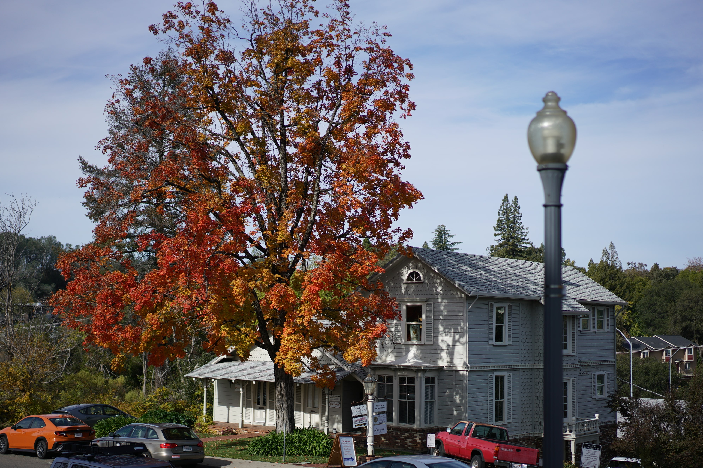
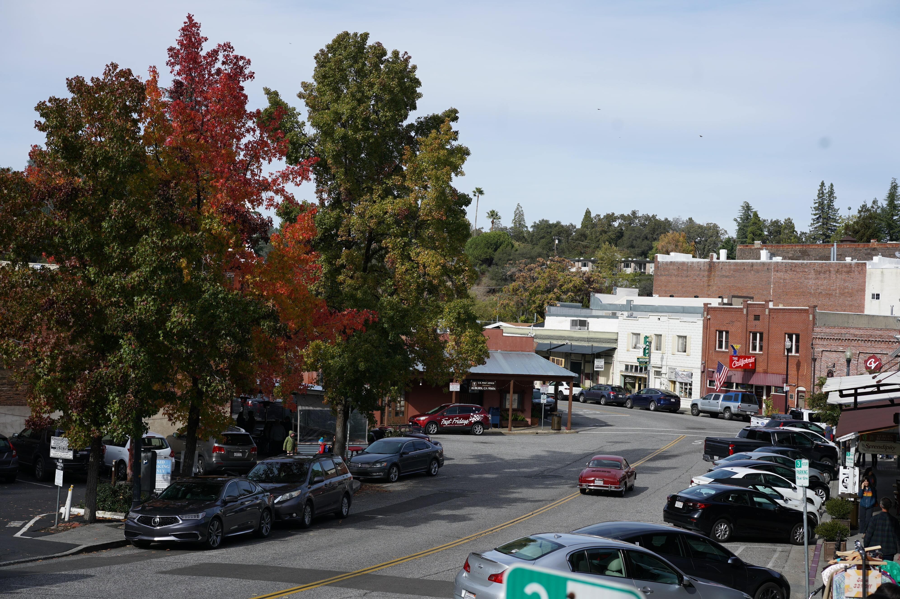
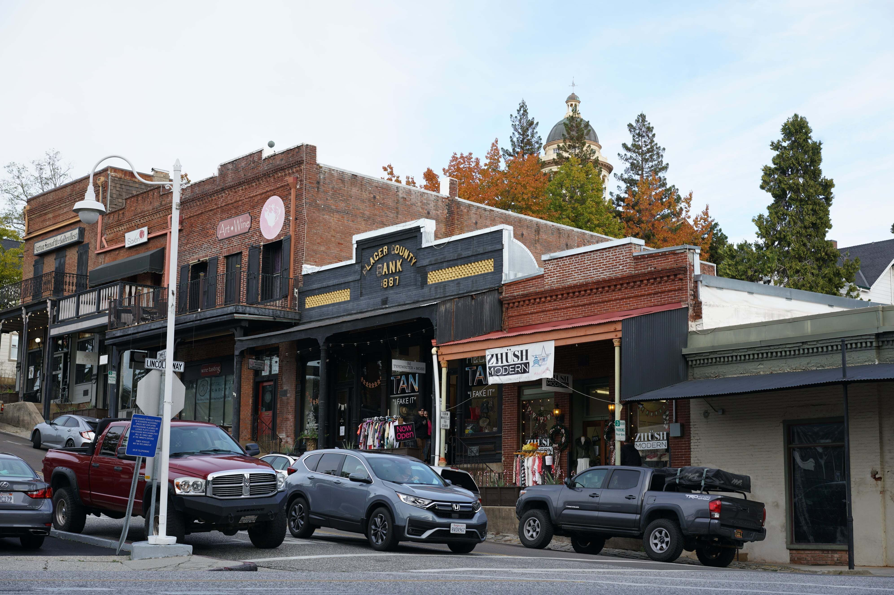
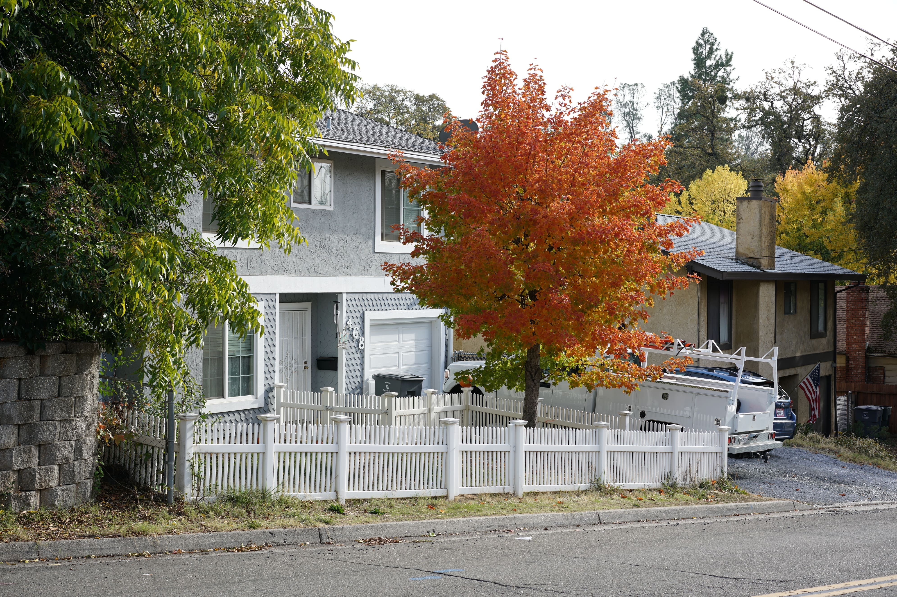

Auburn is a small town just north of Sacramento, and it's quite the perfect daytrip location. My friend and I took Amtrak one early Saturday morning to spend a day here.

You can find numerous cutesy cafés and restaurants in the "downtown" area surrounding the Placer County Courthouse, the "landmark" building of the city. See the top photo.

Always grab a cup of latte at a local café.

The whole town has a very <i>Americana</i> feel to it — which I absolutely love. You don't often see towns like this in Southern California. 

That's an absolutely lovely shot right there. Shout out to my friend @photokuang for the photos.

After doing a quick hike up the hill / mountain, we saw residential areas (like above) on the way down. 